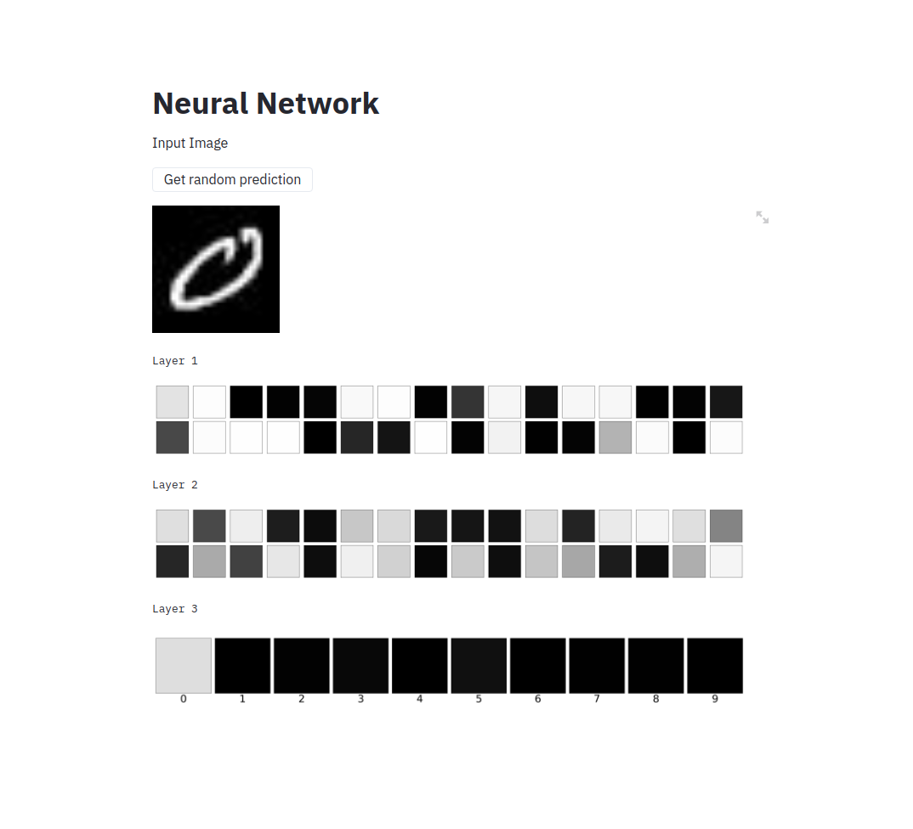

This is a simple Neural Network Visualizer to visualize digit number 
you can try the project yourself 

1) git clone https://github.com/Mohamad-Aboda/Machine-Learning-Study/tree/master/Visualzer_NN_wep_app
2) navigate to the project in the shell
3) run the requirements.txt file to download the requirements for the project in the shell type   ## python requirements.txt
4) open the ml_server.py from your IDE then run the file then keep the server running 
5) in the python shell run the wep app by typing  ## streamlit run app.py 
well done now you try the wep app visualizer by your self 

